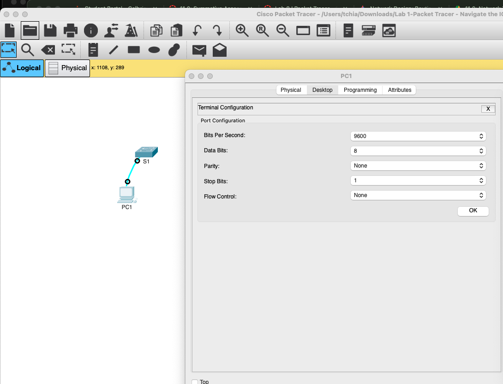
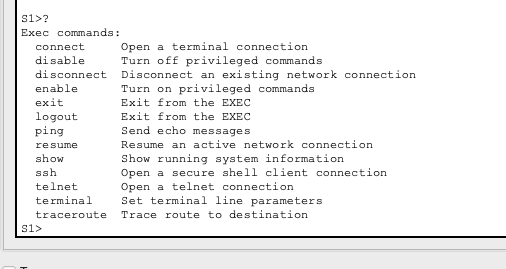
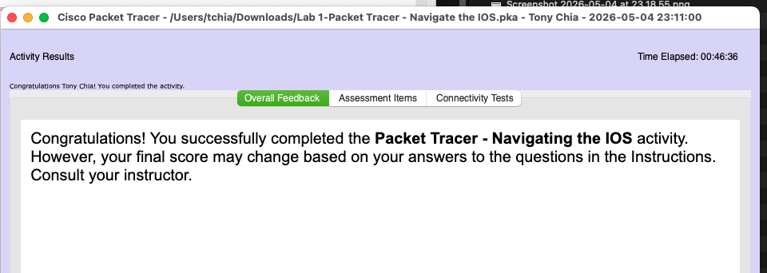
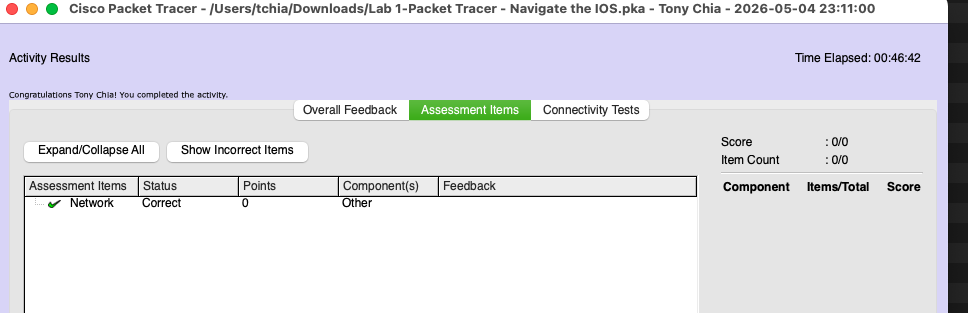

**Remember:**

-   Keep detailed notes during each lab to make documenting easier.

-   Include screenshots or configuration files to support your
    > documentation.

-   Reflect on what you learned in each lab and any challenges you
    > faced.

###  **Check and Document Your Results**

After completing the lab, use the "Check Results" feature as shown in
the video.\
Take at least **two screenshots**:

-   One of the assessments

-   One of the assessment items

Paste these into your Word document along with any required answers.

Part 1 **Establish Basic Connections, Access the CLI, and Explore Help**
------------------------------------------------------------------------

Q: What is the setting for bits per second?

9600

{width="6.5in"
height="2.9101017060367456in"}

Q: What is the prompt displayed on the screen?

S1\>

Q: Which command begins with the letter 'C'?

connect

{width="5.270833333333333in"
height="2.8020833333333335in"}

Q: b. At the prompt, type t and then a question mark (?).

S1\> **t?**

\% Ambiguous command: \"t\"

Q: At the prompt, type te and then a question mark (?).

> S1\> **te?**

#### Question:

> Which commands are displayed?

S1\>te?

telnet terminal

Part 2 **Explore EXEC Modes**
-----------------------------

Q: What information is displayed for the **enable** command?
------------------------------------------------------------

Turn on privileged commands
---------------------------

Q: What displays after pressing the **Tab** key?
------------------------------------------------

enable
------

Q: What would happen if you typed **te\<Tab\>** at the prompt?

Nothing happens since there are more than one possible command for the
command completion to choose from

Q: How does the prompt change?

It changed to S1\#

Q: How many commands are displayed now that privileged EXEC mode is
active?

Five

S1\#c?

clear clock configure connect copy

Q: What is the message that is displayed?
-----------------------------------------

Configuring from terminal, memory, or network \[terminal\]?
-----------------------------------------------------------

Q: How does the prompt change?
------------------------------

Configuring from terminal, memory, or network \[terminal\]?
-----------------------------------------------------------

Enter configuration commands, one per line. End with CNTL/Z.
------------------------------------------------------------

S1(config)\#
------------

Part 3 **Set the Clock**
------------------------

### **Step 1: Use the clock command.**

a. Use the **clock** command to further explore Help and command syntax. Type **show** **clock** at the privileged EXEC prompt.
-------------------------------------------------------------------------------------------------------------------------------

S1\# **show clock**
-------------------

#### Question:

What information is displayed? What is the year that is displayed?
------------------------------------------------------------------

\*21:27:36.161 UTC Sun Feb 28 1993

b. Use the context-sensitive help and the **clock** command to set the time on the switch to the current time. Enter the command **clock** and press ENTER.
-----------------------------------------------------------------------------------------------------------------------------------------------------------

S1\# **clock\<ENTER\>**
-----------------------

#### Question

What information is displayed?
------------------------------

set Set the time and date
-------------------------

c. The "% Incomplete command" message is returned by the IOS. This indicates that the **clock** command needs more parameters. Any time more information is needed, help can be provided by typing a space after the command and the question mark (?).
-------------------------------------------------------------------------------------------------------------------------------------------------------------------------------------------------------------------------------------------------------

S1\# **clock ?**
----------------

#### Question:

What information is displayed?
------------------------------

set Set the time and date
-------------------------

d. Set the clock using the **clock set** command. Proceed through the command one step at a time.
-------------------------------------------------------------------------------------------------

S1\# **clock set ?**
--------------------

#### Questions:

What information is being requested? Current time
-------------------------------------------------

What would have been displayed if only the **clock set** command had been entered, and no request for help was made by using the question mark? Incomplete command.
-------------------------------------------------------------------------------------------------------------------------------------------------------------------

e. Based on the information requested by issuing the **clock set ?** command, enter a time of 3:00 p.m. by using the 24-hour format of 15:00:00. Check to see if more parameters are needed.
--------------------------------------------------------------------------------------------------------------------------------------------------------------------------------------------

S1\# **clock set 15:00:00 ?**
-----------------------------

The output returns a request for more information:
--------------------------------------------------

\<1-31\> Day of the month
-------------------------

MONTH Month of the year
-----------------------

f. Attempt to set the date to 01/31/2035 using the format requested. It may be necessary to request additional help using context-sensitive help to complete the process. When finished, issue the **show clock** command to display the clock setting. The resulting command output should display as:
-------------------------------------------------------------------------------------------------------------------------------------------------------------------------------------------------------------------------------------------------------------------------------------------------------

S1\# **show clock**
-------------------

\*15:0:4.869 UTC Tue Jan 31 2035
--------------------------------

g. If you were not successful, try the following command to obtain the output above:
------------------------------------------------------------------------------------

S1\# **clock set 15:00:00 31 Jan 2035**
---------------------------------------

### **Step 2: Explore additional command messages.**

a. The IOS provides various outputs for incorrect or incomplete commands. Continue to use the **clock** command to explore additional messages that may be encountered as you learn to use the IOS.
---------------------------------------------------------------------------------------------------------------------------------------------------------------------------------------------------

b. Issue the following commands and record the messages:
--------------------------------------------------------

S1\# **cl\<tab\>**
------------------

#### Questions:

What information was returned?
------------------------------

The tab completion didn't work.

S1\# **clock**
--------------

#### Question:

What information was returned?
------------------------------

\% Incomplete command.

S1\# **clock set 25:00:00**
---------------------------

#### Question:

What information was returned? % Invalid input detected at \'\^\' marker.
-------------------------------------------------------------------------

S1\# **clock set 15:00:00 32**
------------------------------

#### Question:

What information was returned? 
-------------------------------

\^

\% Invalid input detected at \'\^\' marker.

Reflection:
-----------

When i typed some incorrect command such as "clclock" , the terminal get
stuck with "Translating \"clclock\"\...domain server (255.255.255.255)".

I tried to close the terminal and start a new one but it didn't seem to
work.

I tried to press control+C or control+d and it didn't seems to work
either

After some time it seems to time out and return to the \# prompt

{width="6.5in"
height="2.3194444444444446in"}

{width="6.5in"
height="2.0972222222222223in"}
